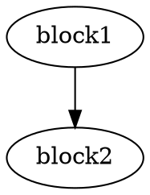

# IMPLEMENTATION DOCUMENT

# LLVM Clone Detection System

---

# 1. Introduction

This document explains the implementation details of the LLVM Clone Detection System.

The system is implemented using:
- C++
- LLVM 18
- CMake
- Python visualization libraries

The project follows a modular compiler-analysis architecture.

---

# 2. LLVM Integration

The system uses LLVM libraries to parse and analyze LLVM Intermediate Representation (IR).

LLVM components used:
- LLVMContext
- Module
- Function
- BasicBlock
- Instruction
- IRReader
- CFG utilities

LLVM allows low-level compiler analysis independent of source language syntax.

---

# 3. IR Parsing Implementation

The IR Parser module loads LLVM IR files and traverses program structures.

Main implementation steps:
1. Load LLVM IR file
2. Parse module
3. Traverse functions
4. Traverse basic blocks
5. Extract instructions
6. Generate fingerprints

Key LLVM APIs used:

```cpp
parseIRFile()
```

```cpp
Function
```

```cpp
BasicBlock
```

```cpp
Instruction
```

The parser skips:
- external declarations
- metadata-only sections
- compiler-generated attributes

---

# 4. Fingerprint Extraction

Each function is represented as an opcode sequence fingerprint.

Example:

```text
alloca
store
load
add
ret
```

Implementation logic:
- Traverse all instructions
- Extract opcode names
- Store opcode sequence
- Associate sequence with function name

Key implementation:

```cpp
I.getOpcodeName()
```

The fingerprint acts as a compact semantic representation of the function.

---

# 5. Opcode Normalization

The normalization module reduces LLVM IR variations.

Implementation goals:
- Remove language-specific artifacts
- Simplify instruction comparison
- Improve consistency

Normalization improves clone detection across different implementations.

---

# 6. CFG Builder Implementation

The CFG Builder extracts Control Flow Graphs from LLVM functions.

Implementation steps:
1. Traverse basic blocks
2. Identify successors
3. Create graph edges
4. Export DOT files
5. Generate PNG graphs using Graphviz

Key LLVM utility:

```cpp
successors(&BB)
```

DOT graph export example:



Graphviz conversion:

```bash
dot -Tpng graph.dot -o graph.png
```

Generated outputs:
- CFG DOT files
- CFG PNG images

---

# 7. Similarity Engine Implementation

The Similarity Engine compares function fingerprints.

Current algorithm:
- Exact opcode sequence matching
- Percentage similarity calculation

Implementation process:
1. Compare opcode sequences
2. Count matching instructions
3. Calculate similarity percentage

Formula:

```text
Similarity = (Matched Instructions / Total Instructions) × 100
```

Clone detection rule:

```text
Similarity >= Threshold
```

Default threshold:
- 70%

---

# 8. Batch Mode Implementation

Batch mode automatically compares multiple LLVM IR files.

Implementation logic:
1. Scan testcase directory
2. Load LLVM IR files
3. Generate fingerprints
4. Compare all functions
5. Store results

Outputs:
- Console logs
- CSV reports
- Text reports

Advantages:
- Automated evaluation
- Faster testing
- Better scalability

---

# 9. CSV Export Implementation

Comparison results are exported to CSV format.

CSV fields:
- Function1
- Function2
- Similarity
- Clone Result

Example:

```csv
Function1,Function2,Similarity,Clone
add,sum,100,YES
```

The CSV file is used for:
- evaluation
- visualization
- analytics generation

---

# 10. Visualization Implementation

Visualization is implemented using Python.

Libraries used:
- Pandas
- Matplotlib
- Seaborn

Visualization pipeline:
1. Load CSV file
2. Parse similarity data
3. Generate graphs
4. Export PNG visualizations

Generated outputs:
- Similarity heatmaps
- Similarity bar graphs

Heatmap implementation:

```python
sns.heatmap()
```

Bar graph implementation:

```python
plt.bar()
```

---

# 11. Command Line Interface

The project uses a command-line interface for execution.

Supported modes:
- Normal comparison
- Verbose mode
- Batch mode
- Custom threshold mode

Examples:

```bash
./clone_detector file1.ll file2.ll
```

```bash
./clone_detector --batch
```

```bash
./clone_detector file1.ll file2.ll --verbose
```

---

# 12. Error Handling

The implementation includes:
- IR parsing validation
- File existence checking
- LLVM module validation
- CSV generation checks

Parser failure example:

```text
Failed to parse LLVM IR!
```

---

# 13. Build System

The project uses CMake.

Build pipeline:
1. Configure LLVM
2. Link LLVM libraries
3. Compile modules
4. Generate executable

Build commands:

```bash
cmake ..
make
```

---

# 14. Performance Considerations

Current implementation focuses on:
- modularity
- simplicity
- correctness

Potential future optimizations:
- parallel comparison
- graph hashing
- optimized fingerprint matching

---

# 15. Future Improvements

Future implementation enhancements:
- advanced graph matching
- DFG analysis
- AST integration
- ML-based similarity scoring
- web dashboard integration

---

# 16. Conclusion

The implementation demonstrates practical usage of LLVM for compiler-level program analysis.

The modular design supports future research extensions and advanced clone detection techniques.
